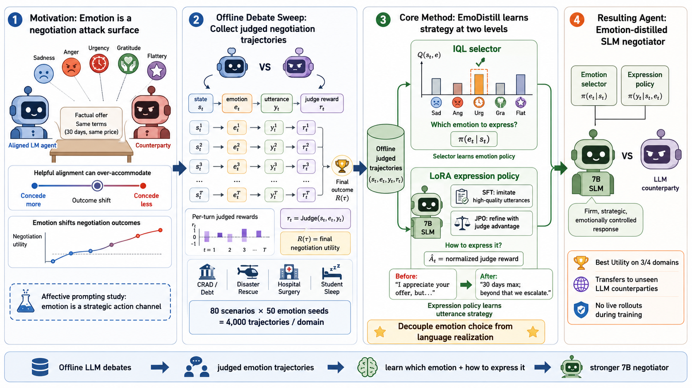

# EmoDistill

**Offline emotion-skill distillation for small language-model negotiation agents.**

EmoDistill turns a 7B base LLM into a domain-adaptive negotiation agent by
decoupling *what emotion to show* from *how to express it*. It learns both
from a fixed offline corpus of LLM-vs-LLM negotiations — no online rollouts,
no human feedback — and refines the expression policy with a per-turn LLM
judge.

---

## News

- 🎉 **EmoDistill code released** (IQL emotion selector + LoRA-SFT expression imitation + JPO refinement).
- 🛠 **OpenAI and DashScope both supported** out of the box — flip via `LLM_PROVIDER` in `.env`.
- 🚧 **Pretrained 7B fine-tuned creditor checkpoint coming soon.**

---

## Workflow



Three trained components compose at inference:

1. **IQL** picks an emotion from a fixed 28-emotion vocabulary at each turn.
2. **LoRA-SFT** learns to *express* high-quality emotion-conditioned utterances by imitation on top-K advantage-filtered offline turns.
3. **JPO (Judge Policy Optimization)** further refines the LoRA adapter with a PPO-clipped surrogate against a per-turn LLM judge, anchored by KL to the SFT init.

---

## Install

```bash
pip install -r requirements.txt
cp .env.template .env
# fill in DASHSCOPE_API_KEYS  (or OPENAI_API_KEY if LLM_PROVIDER=openai)
```

Tested on Python 3.10, PyTorch 2.4, peft 0.12, transformers 4.44.

## LLM provider

Both DashScope (Qwen-Plus) and OpenAI (gpt-4o, gpt-4o-mini, …) are supported
via the same OpenAI-compatible API surface. Pick one in `.env`:

```env
LLM_PROVIDER=dashscope          # or: openai
DASHSCOPE_API_KEYS=sk-...
DASHSCOPE_DEFAULT_MODEL=qwen-plus
# --- alternatively ---
# LLM_PROVIDER=openai
# OPENAI_API_KEY=sk-proj-...
# OPENAI_DEFAULT_MODEL=gpt-4o-mini
```

All downstream code (sweep generation, judge, evaluation) picks up the choice
through `EmoDistill.dashscope_wrapper.DashScopeWrapper` (also exported as
`LLMClient`). No CLI flags need to change.

## Datasets

The four negotiation scenario domains used to train and evaluate EmoDistill
are released by our companion repo:

- **CRAD** — debt collection (`credit_recovery_scenarios.csv`)
- **Disaster** — rescue triage (`disaster_survivor_scenarios.csv`)
- **Hospital** — surgery scheduling (`hospital_surgery_scenarios.csv`)
- **Student** — sleep deprivation counseling (`education_sleep_scenarios.csv`)

Full CSVs (100 scenarios each) and the prompt templates that turn each row
into a negotiation instance live at
👉 **https://github.com/Yunbo-max/EmoMAS**.

This repo bundles only the CRAD CSV as an end-to-end example. To train on the
other three domains, drop the corresponding CSV from EmoMAS into `data/` and
pass `--dataset_type {disaster|medical|student}` to the entry-point scripts.

---

## End-to-end usage

### Stage A — Stochastic emotion sweep
Generate the offline corpus: scenarios × 28 emotions × iterations.

```bash
python -m experiments.run_random_emotion_sweep \
    --dataset_type debt \
    --scenarios 20 --offset 80 --iterations 3 \
    --max_dialog_len 30 \
    --concurrency 6 --seed 42 \
    --out_dir results/sweep
```

### Stage B — Per-turn LLM judge
Score each focal-agent utterance on a 1–10 rubric. This is the reward signal.

```bash
python -m EmoDistill.judge_scorer_v2 \
    --in_json  results/sweep/<run>/random_sweep_*.json \
    --out_json results/sweep/<run>/random_sweep_judged.json \
    --concurrency 6
```

### Stage C — Train IQL → LoRA-SFT → JPO

**C.1 IQL value network**
```bash
python -m experiments.run_iql \
    --dataset_path results/sweep/<run>/random_sweep_judged.json \
    --out_dir results/iql \
    --n_steps 20000 --batch_size 256 \
    --hidden_dim 256 --lr 3e-4 \
    --expectile 0.7 --beta 3.0 \
    --normalize_reward --seed 42
```

**C.2 LoRA-SFT expression imitation**
```bash
python -m experiments.run_lora_train \
    --sweep_dir results/sweep/<run> \
    --scenario_type debt --top_k_percent 0.10 \
    --base_model Qwen/Qwen2.5-7B-Instruct \
    --lora_r 16 --lora_alpha 32 \
    --epochs 1 --batch_size 1 --grad_accum 16 \
    --lr 1e-4 --max_seq_len 1024 \
    --out_dir results/sft
```

**C.3 JPO refinement**
```bash
python -m experiments.run_grpo_train \
    --sweep_dir results/sweep/<run> \
    --scenario_type debt \
    --reward_field judge_score \
    --base_model Qwen/Qwen2.5-7B-Instruct \
    --sft_adapter results/sft/<run>/adapter_final \
    --reference_mode init_snapshot \
    --kl_beta 0.04 --clip_eps 0.2 \
    --epochs 1 --batch_size 1 --grad_accum 16 \
    --lr 5e-6 --warmup_ratio 0.03 \
    --max_seq_len 1024 \
    --output_dir results/jpo
```

### Stage D — Evaluation
Held-out scenarios against an LLM counterparty.

```bash
python -m experiments.run_hierarchical_eval \
    --iql_ckpt    results/iql/iql_*.pt \
    --lora_adapter results/jpo/<run>/adapter_final \
    --base_model Qwen/Qwen2.5-7B-Instruct \
    --dataset_type debt \
    --scenarios 20 --iterations 1 --offset 80 \
    --max_dialog_len 30 --concurrency 4 \
    --seed 42 \
    --out_dir results/eval
```

The output JSON reports success rate, mean savings ratio, mean rounds, and the
per-episode breakdown.

---

## Released artifacts

- ✅ IQL emotion selector
- ✅ LoRA-SFT expression-imitation trainer
- ✅ JPO (judge-PPO) refinement trainer
- ✅ Evaluation harness against an API-served LLM counterparty
- 🚧 **Pretrained 7B fine-tuned creditor checkpoint** — coming soon

## Repo layout

```
.
├── README.md
├── requirements.txt
├── .env.template
├── figs/
│   └── workflow.png             # method overview
├── data/
├── EmoDistill/                  # Method library (IQL, SFT, JPO, judge, LLM client)
├── baselines/                   # Vanilla / Q-learning / evolutionary baselines
├── experiments/                 # Entry-point scripts
│   ├── run_random_emotion_sweep.py
│   ├── run_iql.py
│   ├── run_lora_train.py
│   ├── run_grpo_train.py
│   └── run_hierarchical_eval.py
├── llm/                         # Prompt templates
└── utils/                       # Scenario preprocessing
```

## Citation

```bibtex
@article{emodistill,
  title  = {EmoDistill: Offline Emotion Skill Distillation for Language Model Negotiation Agents},
  year   = {2026}
}
```
